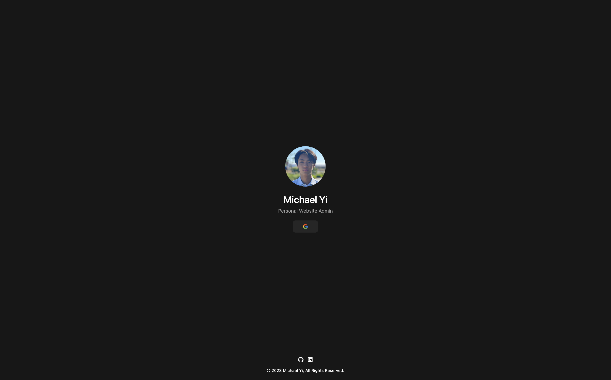
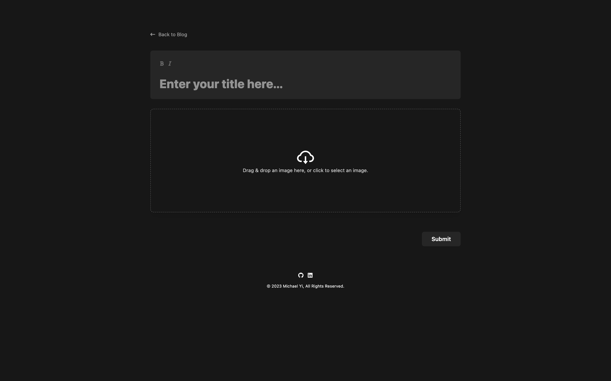
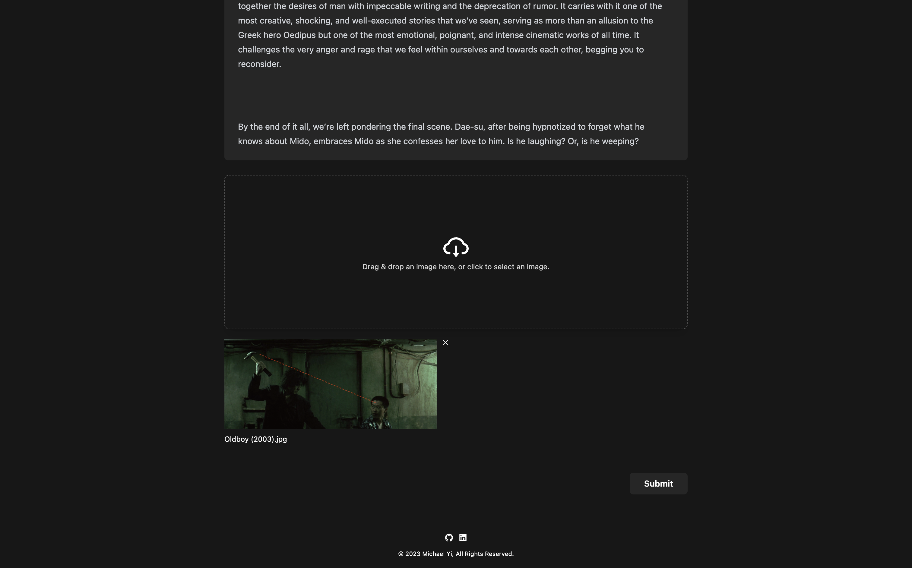

    
    <h2>Michael Yi's Personal Website & Film Blog</h2>
    
© 2023 Michael Yi, All Rights Reserved.

    

        <a href="https://michael-yi.com/">Website</a>&nbsp;&#183;&nbsp;<a href="https://admin.michael-yi.com/">Admin Platform</a>
    

## About 

This repository contains the source code to my personal website and film blog. It is a showcase of my software engineering experience, portfolio, resume, and my passion for cinema.

## Tech Stack

- [Java](https://www.java.com/en/)
- [Spring](https://spring.io/)
- [Gradle](https://gradle.org/)
- [MySQL](https://www.mysql.com/)
- [Redis](https://redis.io/)
- [Docker](https://www.docker.com/)
- [AWS VPC, EC2, S3](https://aws.amazon.com/)
- [JUnit](https://junit.org/junit5/)
- [Mockito](https://site.mockito.org/)
- [Testcontainers](https://testcontainers.com/)
- [Nginx](https://www.nginx.com/)
- [Node.js](https://nodejs.org/en)
- [JavaScript](https://www.javascript.com/)
- [React](https://react.dev/)

## Screenshots

| | |
| - | - |
| |  <tr></tr> |
| |  <tr></tr> |
| |  <tr></tr> |
| |  <tr></tr> |

## Project Stats

